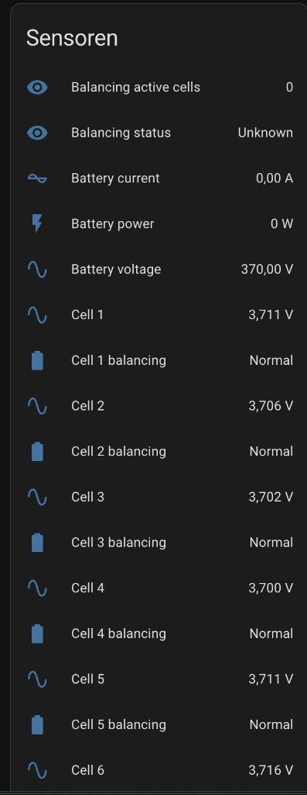
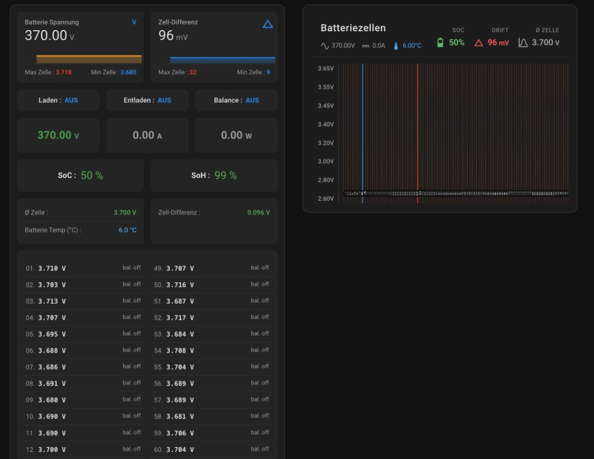

# Battery Emulator (Home Assistant)

Custom Integration für [Battery Emulator](https://github.com/dalathegreat/Battery-Emulator): liest die MQTT-Topics (`{Präfix}/info`, `{Präfix}/spec_data`, `{Präfix}/balancing_data`) und legt **eine Sensor-Entität pro Zelle** sowie **optional pro Zelle einen Balancing-Status** (`binary_sensor`) an. Damit lässt sich die [BMS Battery Cells Card](https://github.com/jayjojayson/bms-battery-cells-card) direkt befüllen.

## Voraussetzungen

- Home Assistant mit konfigurierter **MQTT-Integration** (Broker muss die Nachrichten des Battery Emulator empfangen).
- Im Battery Emulator: MQTT aktiv; **„Transmit all cell voltages“** (`mqtt_transmit_all_cellvoltages`) einschalten, sonst fehlen `spec_data` / Zellspannungen.

## Installation (HACS)

1. HACS → **Integrationen** → ⋮ → **Benutzerdefiniertes Repository**.
2. URL dieses Repositories einfügen, Kategorie **Integration**.
3. **Battery Emulator** installieren und Home Assistant neu starten.

## Einrichtung

**Einstellungen → Geräte & Dienste → Integration hinzufügen → Battery Emulator**

Im Assistenten: MQTT-Topic-Präfix wie im Web-UI des Boards (Standard `BE`), Gerätename, optional zweites Pack.

## Entitäten in Home Assistant

Die Integration legt u. a. Pack-Spannung, Strom, Leistung, SoC, SoH (wenn der BMS liefert), Zell-Differenz, Temperaturen sowie **je Zelle** einen Spannungssensor und (bei empfangenen Balancing-Daten) ein **Binary Sensor** „Cell N balancing“ an.



## Dashboard: BMS Battery Cells Card

Mit `show_detailed_view: true` erhältst du die Übersicht mit Kennzahlen, Zellenliste und optional Balkendiagramm – wie in diesem Beispiel (96 Zellen, Entitäts-Präfix `battery_emulator`).



### Fertige Lovelace-YAML im Repository

Im Projekt liegt eine **vollständige Kartenkonfiguration** inklusive aller Zell-Entitäten (Standard 1–96, bei Bedarf kürzen):

**[dashboard-bms-battery-cells-card.yaml](dashboard-bms-battery-cells-card.yaml)**

**Einbindung:** Dashboard bearbeiten → Karte hinzufügen → **Manuell / YAML** → Inhalt der Datei einfügen (oder per Raw-Dashboard-Editor).

**Wichtig:** Wenn dein Gerät in HA anders heißt, unter *Entwicklerwerkzeuge → Zustände* nach `cell_` filtern und alle `entity:`-Zeilen sowie die `*_entity:`-Keys auf deine echten IDs anpassen.

### Wichtige Karten-Optionen (jayjojayson-Karte)

Die offizielle README der Karte listet nicht alle Felder; im **Karten-Editor** sind u. a. diese Sensoren vorgesehen:

| YAML-Key | Zweck | Typische Integration-Sensor-ID |
| -------- | ----- | ------------------------------ |
| `soc_entity` | Ladezustand | `sensor.…_soc` |
| `watt_entity` | Leistung (W) | `sensor.…_battery_power` |
| `total_voltage_entity` | Pack-Spannung (V) | `sensor.…_battery_voltage` |
| `total_current_entity` | Strom (A) | `sensor.…_battery_current` |
| `cell_diff_sensor` | Zell-Differenz (mV) | `sensor.…_cell_voltage_delta` |
| `temp_entity` | Temperatur | `sensor.…_temperature_max` |
| `soh_entity` | State of Health (%) | `sensor.…_state_of_health` |
| `show_detailed_view` | Detail-Dashboard | `true` |

Ergänzend: `min_voltage` / `max_voltage`, `show_min_max`, `show_average`, `show_values`, `enable_animations`, `show_legend` – siehe [dashboard-bms-battery-cells-card.yaml](dashboard-bms-battery-cells-card.yaml).

### Pro Zelle: Balancing in der Karte

Unter jedem Listeneintrag `cells` kann optional `balance_entity` gesetzt werden (Binary Sensor der Integration), damit die Karte den Balancing-Status pro Zelle nutzt:

```yaml
cells:
  - entity: sensor.battery_emulator_cell_1
    name: "1"
    balance_entity: binary_sensor.battery_emulator_cell_1_balancing
  - entity: sensor.battery_emulator_cell_2
    name: "2"
    balance_entity: binary_sensor.battery_emulator_cell_2_balancing
```

(Analog für alle Zellen; die fertige Datei im Repo enthält standardmäßig nur die Spannungs-Entitäten – `balance_entity` bei Bedarf ergänzen oder per Editor.)

### Kurzbeispiel (Auszug)

```yaml
type: custom:bms-battery-cells-card
title: Batteriezellen
cells:
  - entity: sensor.battery_emulator_cell_1
    name: "1"
  - entity: sensor.battery_emulator_cell_2
    name: "2"
  # … weitere Zellen
soc_entity: sensor.battery_emulator_soc
watt_entity: sensor.battery_emulator_battery_power
total_voltage_entity: sensor.battery_emulator_battery_voltage
total_current_entity: sensor.battery_emulator_battery_current
cell_diff_sensor: sensor.battery_emulator_cell_voltage_delta
temp_entity: sensor.battery_emulator_temperature_max
soh_entity: sensor.battery_emulator_state_of_health
show_detailed_view: true
min_voltage: 2.6
max_voltage: 3.65
```

## Doppelte Entitäten

Wenn im Battery Emulator **Home Assistant Autodiscovery** aktiv ist, legt der Broker zusätzlich MQTT-Discovery-Sensoren an. Diese Integration erzeugt eigene Entitäten für die BMS-Karte. Entweder Autodiscovery im Emulator deaktivieren oder die nicht benötigten MQTT-Entitäten ignorieren/deaktivieren.

## Hinweis

Hohe Spannung an Batterien birgt Risiken. Nur nach geltenden Vorschriften und mit Fachkenntnis arbeiten.

Passe in `manifest.json` das Feld `codeowners` auf deinen GitHub-Benutzernamen an, bevor du das Repository veröffentlichst.
